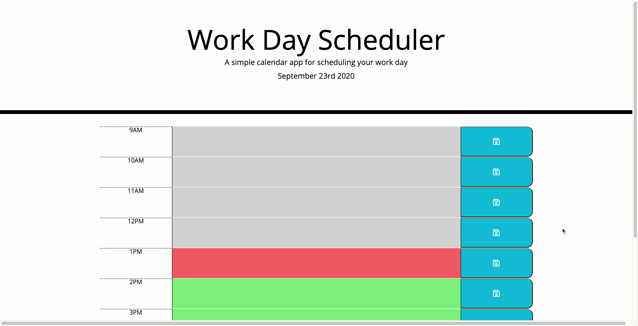

# Daily-Planner
This application is a daily planner. The object of the planner is to save events on the desired time block into local storage. You can clear events from local storage as well. 

As the day goes on, the current hour will be in red, past hours will be gray, and future hours will be green. It will also tell you the current date at the top of the page.

Deployed Site: https://drfrank22.github.io/Daily-Planner/